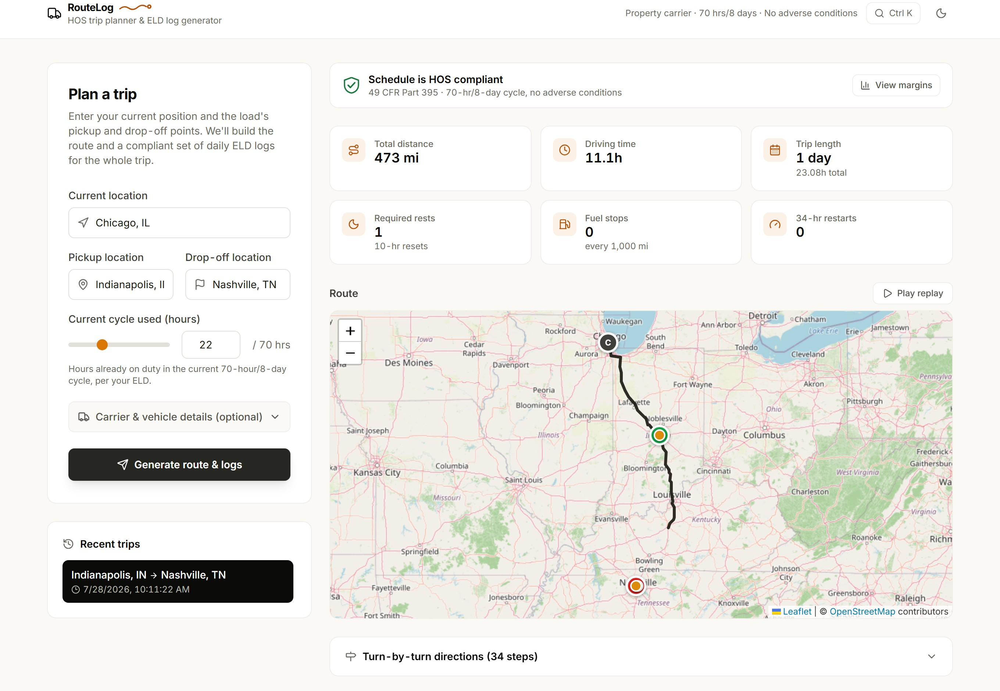
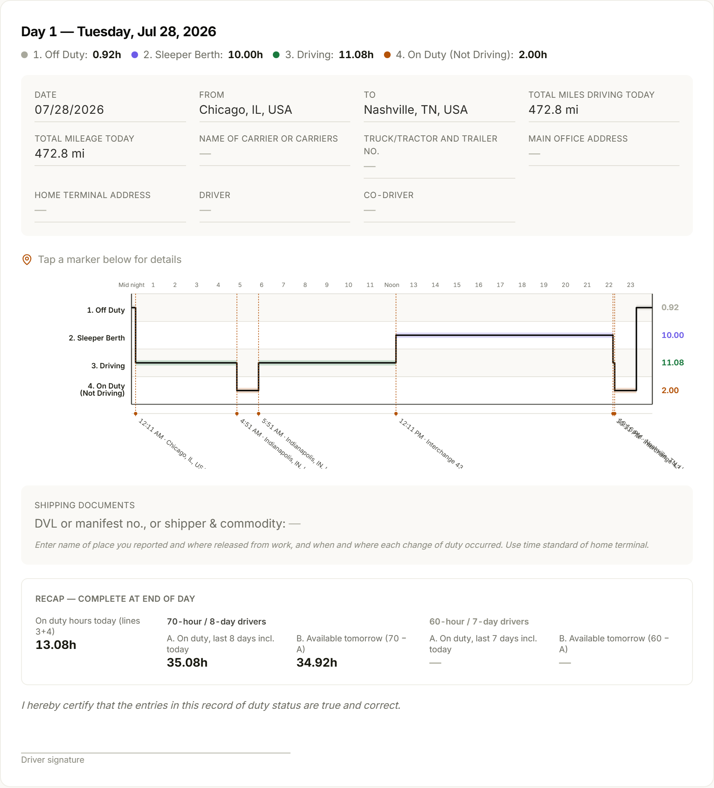
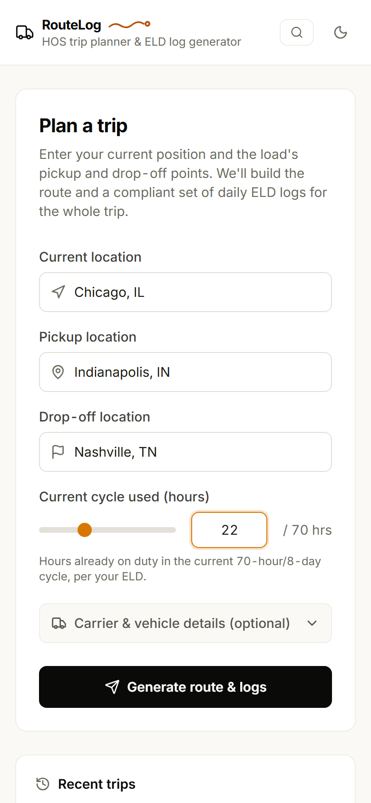
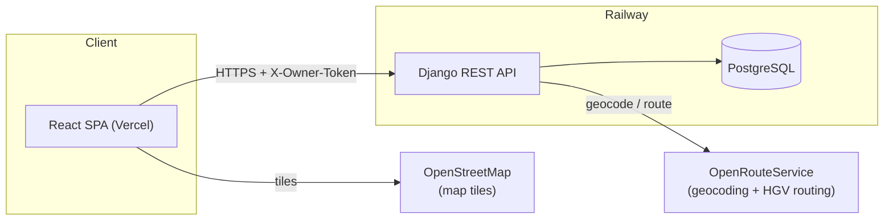

# RouteLog: HOS Trip Planner and ELD Log Generator

[](https://github.com/zuraiz-anjum/Full-stack-Assesment/actions/workflows/ci.yml)

Takes a trip (current location, pickup, drop-off, and how many hours are already
used in the driver's 70-hour/8-day cycle) and produces a driving route plus a
full set of FMCSA daily log sheets, laid out to match the real paper form field
for field. Every required rest break, 30-minute break, 10-hour reset, 34-hour
restart, and fuel stop gets worked out automatically and shown on the log grid,
not approximated after the fact.

**Live app:** https://full-stack-assesment-smoky.vercel.app
**API:** https://full-stack-assesment-production.up.railway.app/api

## Screenshots

| Route + summary | Daily log sheet | Mobile |
|---|---|---|
|  |  |  |

## Features

**Route planning.** Geocodes the three locations, pulls a real HGV
(heavy-goods-vehicle) driving route with turn-by-turn directions, and plots it
on an interactive map with every stop marked. A "play replay" button retraces
the whole trip on the map, truck icon included.

**FMCSA-accurate daily logs.** A full hours-of-service simulation runs behind
this, not a rough approximation: the 11-hour driving limit, the 14-hour window,
a 30-minute break after 8 hours of driving, 10-hour resets, 34-hour restarts,
70-hour/8-day cycle tracking, and a fuel stop every 1,000 miles. The daily log
grid matches the real Driver's Daily Log form field for field: numbered duty
rows, a shipping documents section, and the 70-hour/8-day recap box (the
60-hour/7-day column is left intentionally blank, since that's not the cycle
this app simulates, the same way a driver whose carrier doesn't use it would
leave it blank on the real form).

**Real PDF export.** A server-side endpoint renders each daily log as its own
page with reportlab, black and white like the actual paper form. It's meant to
be printed and read as the real document, not a colored app export.

**A real status sequence while a trip is planned.** Instead of a plain spinner,
a short checklist tracks what the backend is actually doing (geocoding,
routing, applying HOS rules, building the logs) while the request is still in
flight.

**A command palette.** Ctrl+K (or Cmd+K on a Mac) opens a quick-actions
palette: jump to a recent trip, toggle dark mode, download the PDF, share,
print.

**Night driving mode.** A full dark theme, including an inverted map basemap,
that switches back to light automatically before printing so a daily log
sheet never comes out unreadable on paper.

**Shareable read-only links.** Hand a trip's route and logs to someone else,
a dispatcher for example, through a link that needs no account and doesn't
depend on the recipient's own trip history.

**A shareable summary image.** One button renders a canvas summary card
(route line, key stats) that downloads, or on mobile opens the native share
sheet.

**Mobile-first.** Lazy-loaded map that cuts the initial JS payload noticeably,
a responsive log grid with a swipe hint, auto-scroll to results on submit.

**Hardened for production.** CSP, HSTS, rate limiting, per-browser trip
scoping so no visitor can see another visitor's trips, dependency-scanned
with `npm audit` and `pip-audit`.

**Tested.** 102 backend tests (HOS engine, log splitting, routing, the
trip-planning orchestration layer, the API's HTTP contract, PDF generation,
trip scoping) and 40 frontend tests, both running on every push through
GitHub Actions.

## Architecture



## Stack

- **Backend:** Django + Django REST Framework, PostgreSQL (Railway)
- **Frontend:** React (Vite) + Tailwind CSS, react-leaflet for the map
- **Routing/geocoding:** OpenRouteService (HGV driving profile, US-only)
- **PDF generation:** reportlab
- **Hosting:** Railway (backend + Postgres), Vercel (frontend)
- **CI:** GitHub Actions (backend + frontend test suites, lint, build)

## How it works

1. The three locations get geocoded, restricted to specific place types
   (cities, addresses, venues, that kind of thing) so a vague query like a
   bare state name can't resolve to that state's geographic centroid and
   hand back a point nowhere near a real road. A driving route is then
   fetched for each leg (current to pickup, pickup to drop-off) using
   OpenRouteService's HGV profile, turn-by-turn instructions included.
2. The trip's start time is resolved to the driver's actual local wall
   clock, via the current location's longitude (see `tz_resolver.py`), not
   the server's clock, since HOS rules run on wall-clock time at the
   driver's location.
3. The route legs feed into an hours-of-service simulation engine
   (`backend/trips/services/hos_engine.py`) that walks the trip constraint
   by constraint and inserts every rest period the regulations require: a
   30-minute break after 8 cumulative hours of driving, a 10-hour reset once
   the 11-hour driving or 14-hour window limit is hit, a fuel stop every
   1,000 miles, and a 34-hour restart if the 70-hour/8-day cycle runs out.
4. The resulting timeline gets split into calendar days (`log_builder.py`).
   Each day becomes one log sheet: per-status time totals, per-day mileage,
   a stepped duty-status graph, and remarks showing where each status change
   happened. A day whose driving simply continues past midnight without a
   status change right at the boundary gets its From/To filled in by
   interpolating the truck's actual position along the route at that exact
   moment, so two consecutive log pages always agree on where the truck was.
5. Everything comes back as one JSON payload and renders client-side: the
   map, turn-by-turn directions, summary cards, a compliance shield with the
   HOS margin numbers tucked behind their own button, and a hand-built SVG
   replica of the FMCSA daily log grid, matching the real form's field
   layout down to the carrier, vehicle, and shipper fields (all optional on
   the trip form). Log sheets download as a real PDF (`pdf_builder.py`,
   server-rendered) or print straight from the browser.

## Assumptions

Per the assignment brief:

- Property-carrying driver on the 70-hour/8-day cycle, no adverse driving
  conditions exception applied.
- A fuel stop is scheduled at least once every 1,000 miles.
- Pickup and drop-off each take 1 hour, logged as on-duty (not driving).
- The 30-minute mandatory break is logged as off-duty; 10-hour resets and
  34-hour restarts are logged as sleeper berth (both count identically
  toward the HOS limits, this only affects which grid row they land on).
- Trip start time defaults to the driver's local "now," resolved from the
  current location; there's no input for a scheduled future start time.
- Timezone resolution is longitude-based rather than true geographic
  boundaries, accurate for the vast majority of US locations but can be off
  by one zone right at a state border.
- No user accounts. Each browser gets an anonymous token, stored in
  localStorage, that scopes its own trip history server-side. See
  `ownerToken.js` and the `owner_token` field on `Trip`.

## Running locally

### Backend

```bash
cd backend
python -m venv venv
source venv/Scripts/activate    # or venv/bin/activate on macOS/Linux
pip install -r requirements.txt
cp .env.example .env            # then fill in ORS_API_KEY
python manage.py migrate
python manage.py runserver
```

`ORS_API_KEY` is a free key from https://openrouteservice.org/dev: sign up,
request a token, paste it into `.env`.

Run the backend test suite (HOS engine, daily-log splitting, geometry
helpers, timezone resolution, PDF generation, the trip-planning
orchestration layer with routing mocked out, and the API's HTTP contract):

```bash
python manage.py test trips
```

### Frontend

```bash
cd frontend
npm install
cp .env.example .env    # VITE_API_BASE_URL, defaults to localhost:8000/api
npm run dev
```

Run the frontend test suite (Vitest + React Testing Library):

```bash
npm run test
```

## API

There's no user auth. Every request from the frontend carries an
`X-Owner-Token` header (a random UUID generated once per browser and stored
in localStorage) that scopes trip history and detail lookups to that
browser. A request with no token, or someone else's token, gets an empty
list or a 404, never another visitor's data.

- `POST /api/trips/`: plan a trip. Required body: `current_location`,
  `pickup_location`, `dropoff_location`, `current_cycle_used_hours`.
  Optional: `carrier_name`, `main_office_address`, `home_terminal_address`,
  `truck_number`, `trailer_number`, `driver_name`, `co_driver_name`,
  `shipping_doc_number` (used only to fill out the printed log sheet's
  header fields). Returns the full route, turn-by-turn directions, stop
  list, daily logs, and a `share_token` for the read-only link; persists
  the trip under the caller's owner token. Rate-limited to 20 requests per
  hour per IP.
- `GET /api/trips/`: the calling browser's own recent trip history (most
  recent 20), scoped by `X-Owner-Token`.
- `GET /api/trips/<id>/`: a previously planned trip, owner-token scoped.
- `GET /api/trips/<id>/pdf/`: the trip's daily logs as a real PDF, one page
  per day, owner-token scoped.
- `GET /api/shared/<share_token>/`: public, read-only lookup by a trip's
  share token, no owner token required. Doesn't echo the token back.
- `GET /api/shared/<share_token>/pdf/`: same PDF export, public.
- `GET /api/locations/autocomplete/?q=`: location suggestions for the form.
  Rate-limited to 60 requests per minute per IP.
